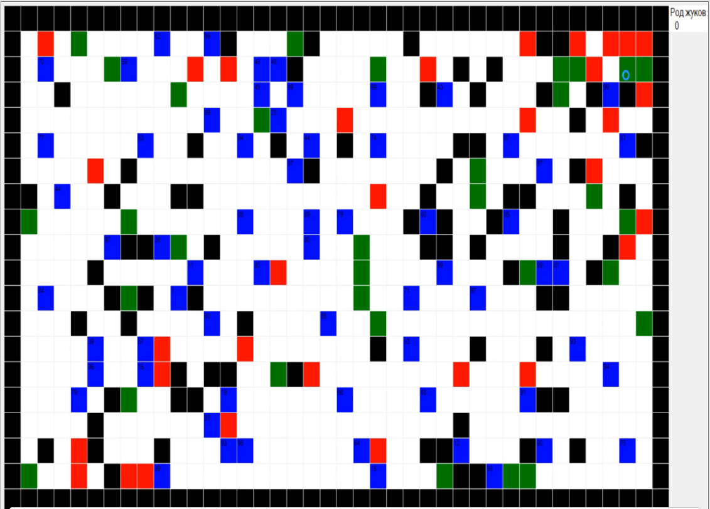

# GeneticAlgorithm
Репозиторий содержит первый проект с использованием генетических алгоритмов для симуляции эволюционного процесса

## Новая версия
[Обновленная версия](https://github.com/IngeniariusSoftware/Evolution), разработанная с нуля на Unity

## Описание

На главном экране отображается эволюционный процесс, происходящий в смоделированном мире. Синим цветом обозначены жуки, которые имеют
геном, (случайный набор команд) с помобщью которого реализовано их поведение. Они перемещаются по карте, размножаются и взаимодействуют с
окружающей средой

Игровой экран:

## Авторы

* **Максим Шипицин** - *Разработка проекта и требований* - [ IngeniariusSoftware](https://github.com/IngeniariusSoftware)

* **Кирилл Грищук** - *Разработка проекта и требований* - [ Kirya522](https://github.com/kirya522)

## License

This project is licensed under the MIT License - see the [LICENSE.md](LICENSE.md) file for details

## Спасибо
- Каналу [foo52ru](https://www.youtube.com/user/foo52ru) за демонстрацию возмонжностей применения генетических алгоритвом и создание
эволюционной модели с их использованием
